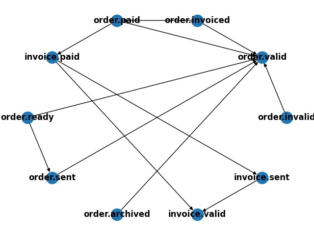

# A Unified View on Data Object State - Prototypical Implementation

This repository contains the prototypical implementation of the data object state concept introduced in our paper, *"A Unified View on Data Object States."* This work bridges the gap between process control flow and data management by formalizing and generalizing the definition of data object states in business process models.

## Table of Contents
- [Getting Started](#getting-started)
  - [Prerequisites](#prerequisites)
  - [Installation](#installation)
- [Project Structure](#project-structure)
- [Usage](#usage)
- [Execution Flow in main.py](#execution-flow-in-mainpy)
- [Limitations and Syntactic Sugar](#limitations-and-syntactic-sugar)
- [Example Output](#example-output)
- [Extending the Demo Case](#extending-the-demo-case)
  - [1. Extending the DMN Table](#1-extending-the-dmn-table)
  - [2. Extending the Log, Object Classes, and Objects](#2-extending-the-log-object-classes-and-objects)
  - [3. Extending the Evaluation of Data Object States](#3-extending-the-evaluation-of-data-object-states)
- [Using the order-management OCEL](#using-the-order-management-ocel)

## Getting Started

### Prerequisites

Ensure you have the following installed:

- Python 3.8 or higher
- pip (Python package installer)

### Installation

1. **Clone the Repository**:
    ```sh
    git clone https://github.com/WilliamBrandt/Data-Object-State-Abstraction.git
    cd Data-Object-State-Abstraction
    ```

2. **Install Dependencies**:
    ```sh
    pip install -r requirements.txt
    ```

---

## Project Structure

- **`data/`**: Contains the specifications required for evaluating Data Object States:
  - DMN tables for the `Order` and `Invoice` classes.
  - An OCEL log in two temporal variants (one includes an additional `Deliver Order` event).
  - A reference Order-to-Cash (O2C) BPMN process model, provided for illustrative purposes only (it does not affect the state evaluation).

- **`src/`**: Contains the prototype implementation:
  - **Parsing**:
    - `dmnParser.py`: Parses DMN tables.
    - `ocel2Parser.py`: Parses OCEL files.
  - **Utility Classes**: 
    - `dmnTable.py`, `dmnInputType.py`, and `genericObject.py` provide core classes for parsing and evaluation.
  - **Cyclical Dependency Check**: 
    - `dmnGraph.py` detects and handles cyclical dependencies.
  - **State Evaluation Logic**:
    - `dmnEvaluator.py` implements the logic for evaluating data object states.
  - `main.py`: Coordinates the entire process. This script serves as the entry point for testing and configurations.

- **`tests/`**: Contains unit tests:
  - `tests_dmnEvaluator.py`: Validates the correctness of state evaluation logic.
  - `test_dmnGraph.py`: Ensures proper functioning of cycle detection logic.

- **`requirements.txt`**: Specifies the Python dependencies for the project.


## Usage

1. **Run Tests**:
   Before executing `main.py`, it is recommended to run the unit tests to verify the setup:
    ```
    python .\tests_dmnEvaluator.py
    python .\tests_dmnGraph.py
    ```
2. **Execute the Prototype**: 
    Run main.py to evaluate the state of data objects:
    ```
    python .\main.py
    ```
    By default, the script reads the DMN tables for `Invoice` and `Order`, along with the first event log. It evaluates the states of the `Ord1` order.

## Execution Flow in `main.py`
1. Parse DMN tables and translate them into internal classes.
2. Read the OCEL log.
3. Initialize the evaluator and check for cyclical state dependencies. (Use the `debugging` attribute in the `DMNEvaluator` object to enable detailed evaluation logs.)
4. Evaluate the state of a data object from the log (default: the order with id `Ord1`).

If a cycle is detected in the DMN tables, the program terminates and outputs a state dependency graph to identify the issue. You can also manually generate the graph using: `evaluator.visualiseGraph()`:
<figure>
  
  <figcaption>Image of a state dependency graph without cycle</figcaption>
</figure>


## Limitations and Syntactic Sugar

This implementation serves as a visualization of the concepts presented in the paper. It differs in functionality and scope from the theoretical framework. Key aspects to highlight:

- **Nested State Definitions**: The `state` column at the beginning of the example DMN tables enables the construction of nested state definitions. In the paper, this corresponds to the helper function `s(s, state, o)`. This feature is provided as syntactic sugar; the same functionality can be achieved manually by incorporating the conditions of the nested states directly into the parent state definition.

- **Conditions on Links**: Currently, conditions on links are limited to the functionality of `amount()`—which calculates the number of existing links to objects of a class—and `amount('X')`—which calculates the number of existing links to objects of a class in a specific state X. More advanced functions, such as checking for existence or evaluating conditions across all links, are left for future development.

- **Conditions on Events**: Conditions on events allow checking the number of events of a specific type using ```amount('type')```. However, temporal ordering of events is not considered, and it is not currently possible to access the values associated with events. These limitations will also be addressed in future work.

## Example Output
By default, the system evaluates the states of the order with id `Ord1`.

**Initial State Evaluation:**
The system detects `Ord1` as being in the `valid`, `paid` and `ready` states.

**Adding an DeliverOrder Event:**
After appending an `deliverOrder` event linked to `Ord1` (by using the extended event log `O2C_event_log_with_DeliverOrder.json`) and reevaluating, the system places `Ord1`  in the `valid`, `paid`, and `sent` states.


## Extending the Demo Case

Want to customize the demo case? Fantastic! There are three levels of extension available to you, ranging in complexity:

### 1. Extending the DMN Table

You can add or modify states using the online editor at [demo.bpmn.io/dmn](https://demo.bpmn.io/dmn). To get started:

- Import an existing DMN table from the `data/` folder and adapt it to your needs.
- Use the semantics from the provided examples as a guide, which cover many possible scenarios.

#### Column Naming Conventions:
- **Attributes**: `<<attribute>> [attribute name]`
- **Links**: `<<link>> [object class]`
- **Events**: `events`
- **Nested States**: Use the column `state` to construct nested state definitions.

If you're adding a new DMN table for a different object class, ensure that:
1. The table name matches the class name.
2. The table is properly imported in `main.py`.

Additionally, if you reference new attributes, objects, or events, remember to extend the OCEL log accordingly to reflect these changes.

### 2. Extending the Log, Object Classes, and Objects

To update or expand the OCEL log:

- Modify or add entries for event types, object types, events, and objects.
- Use the structure of the existing log as a guide.

For visualization, the website [ocelot.pm](https://ocelot.pm/) provides tools to view OCEL logs interactively. When reading the log, the system verifies its adherence to the OCEL standard. If the log fails validation, the process halts with an error message explaining the issue.

### 3. Extending the Evaluation of Data Object States

To extend the evaluation logic:

- Modify the `DMNEvaluator` class in the `src/` folder.
- Consider using test-driven development (TDD) to avoid introducing side effects.

For guidance, refer to the existing unit tests in `test_dmnEvaluator.py`. These tests provide templates that can be adapted for your new evaluation logic.


Happy extending!

## Using the order-management OCEL

In order to apply the tool to the [order-management OCEL](https://doi.org/10.5281/zenodo.8337463) published on the official [OCEL standard website](https://www.ocel-standard.org/), download the .json file and place it into the `data/` directory. Afterward, follow the instructions in the comments of the `main.py` to uncomment the correct lines. The provided DMN table only defines a basic set of states for order objects that you can extend following the instructions above.
